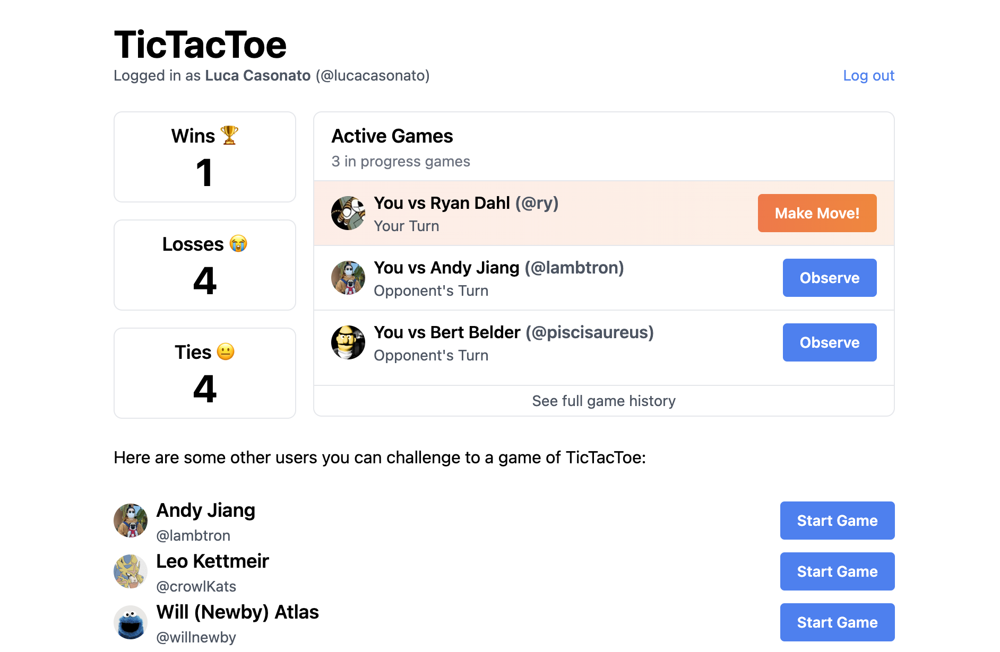

# Tic-Tac-Toe

This is a global, real-time multiplayer Tic-Tac-Toe game written in Deno. It
persists game states in a Deno KV store, and synchronizes game state between
clients using BroadcastChannel.

## Features

- Real-time multiplayer game
- Global persistent game state using Deno KV
- Synchronizes game state between clients using BroadcastChannel
- Uses GitHub OAuth for authentication

This project is hosted on Deno Deploy:

- Served from 35 edge locations around the world
- Scales automatically
- Data is a globally distributed Deno KV store with no setup required
- Code is deployed automatically when pushed to GitHub
- Automatic HTTPS (even for custom domains)
- Free for most hobby use cases

## Example

You can try out the game at https://tic-tac-toe-game.deno.dev



## Development

To develop locally, you must create a GitHub OAuth application and set the
following environment variables in a `.env` file:

```
GITHUB_CLIENT_ID=...
GITHUB_CLIENT_SECRET=...
```

You can create a GitHub OAuth application at
https://github.com/settings/applications/new. Set the callback URL to
`http://localhost:8000/auth/oauth2callback`.

You can then start the local development server:

```
deno task start
```

JS Map cannot pass from handler to JSX component because of JSON.stringify used
